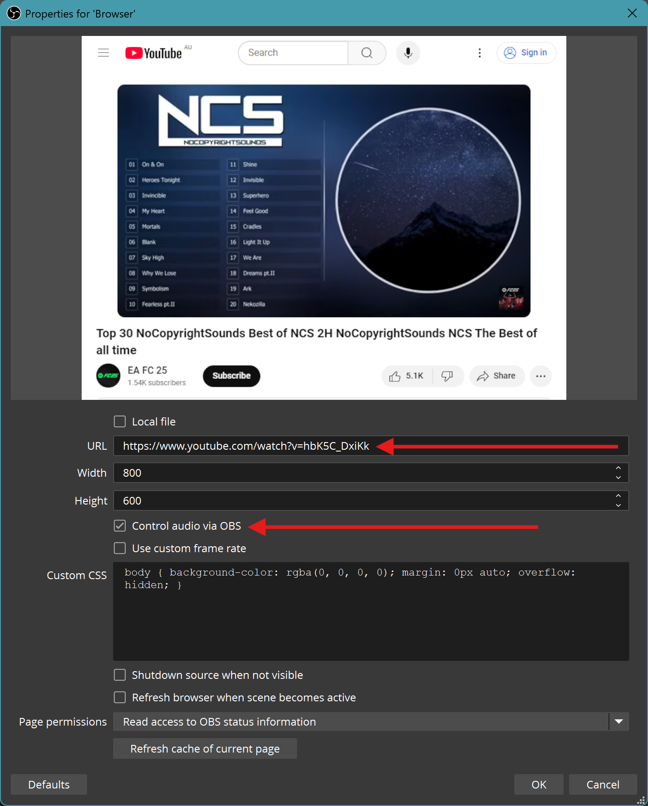
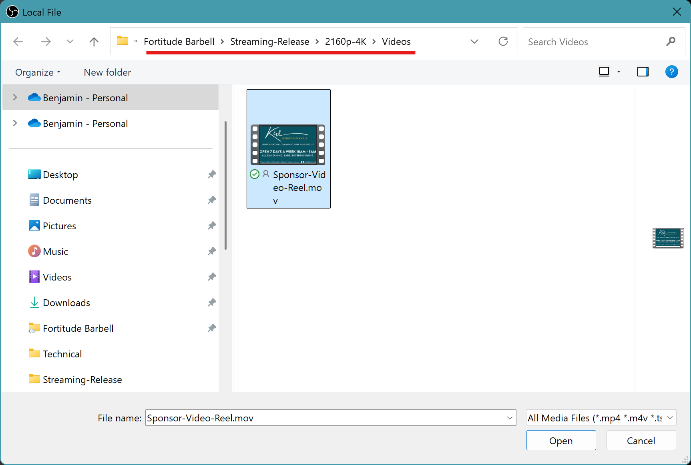

<table>
  <thead>
    <tr>
      <th style="width:500px">Step</th>
      <th style="text-align:center;">OBS Screenshot</th>
    </tr>
  </thead>
  <tbody>
    <tr>
    <td>
      Sources 
      
      <svg xmlns="http://www.w3.org/2000/svg" viewBox="0 0 24 24"><path d="M4 11v2h12l-5.5 5.5 1.42 1.42L19.84 12l-7.92-7.92L10.5 5.5 16 11z"></path></svg>
      
      (Add Source)
    </td>
      <td></td>
    </tr>
    <tr>
      <td>Browser Source</td>
      <td></td>
    </tr>
    <tr>
      <td>Browser Properties
       URL: <a href="https://www.youtube.com/watch?v=hbK5C_DxiKk" target="_blank">https://www.youtube.com/watch?v=hbK5C_DxiKk</a>
       ✅ Control audio via OBS 
      </td>
      <td></td>
    </tr>
    <tr>
    <td>
      Sources 
      
      <svg xmlns="http://www.w3.org/2000/svg" viewBox="0 0 24 24"><path d="M4 11v2h12l-5.5 5.5 1.42 1.42L19.84 12l-7.92-7.92L10.5 5.5 16 11z"></path></svg>
      
      (Add Source)
    </td>
      <td></td>
    </tr>
    <tr>
      <td>Media Source</td>
      <td></td>
    </tr>  
    <tr>
      <td>Media Source Path: OneDrive/FortitudeBarbell/Streaming-Release/2160p-4K/Videos/Sponsor-Video-Reel.mov (Enable loop option)</td>
      <td></td>
    </tr>
  </tbody>
</table>

<table>
  <thead>
    <tr>
      <th style="width:500px">Step</th>
      <th style="text-align:center;">OBS Screenshot</th>
    </tr>
  </thead>
  <tbody>
    <tr>
    <td>
      Sources 
      
      <svg xmlns="http://www.w3.org/2000/svg" viewBox="0 0 24 24"><path d="M4 11v2h12l-5.5 5.5 1.42 1.42L19.84 12l-7.92-7.92L10.5 5.5 16 11z"></path></svg>
      
      (Add Source)
    </td>
      <td></td>
    </tr>
    <tr>
      <td>Browser Source</td>
      <td></td>
    </tr>
    <tr>
      <td>Browser Properties
       URL: <a href="https://www.youtube.com/watch?v=hbK5C_DxiKk" target="_blank">https://www.youtube.com/watch?v=hbK5C_DxiKk</a>
       ✅ Control audio via OBS 
      </td>
      <td></td>
    </tr>
    <tr>
    <td>
      Sources 
      
      <svg xmlns="http://www.w3.org/2000/svg" viewBox="0 0 24 24"><path d="M4 11v2h12l-5.5 5.5 1.42 1.42L19.84 12l-7.92-7.92L10.5 5.5 16 11z"></path></svg>
      
      (Add Source)
    </td>
      <td></td>
    </tr>
    <tr>
      <td>Media Source</td>
      <td></td>
    </tr>  
    <tr>
      <td>Media Source Path: OneDrive/FortitudeBarbell/Streaming-Release/2160p-4K/Videos/Sponsor-Video-Reel.mov (Enable loop option)</td>
      <td></td>
    </tr>
  </tbody>
</table>
