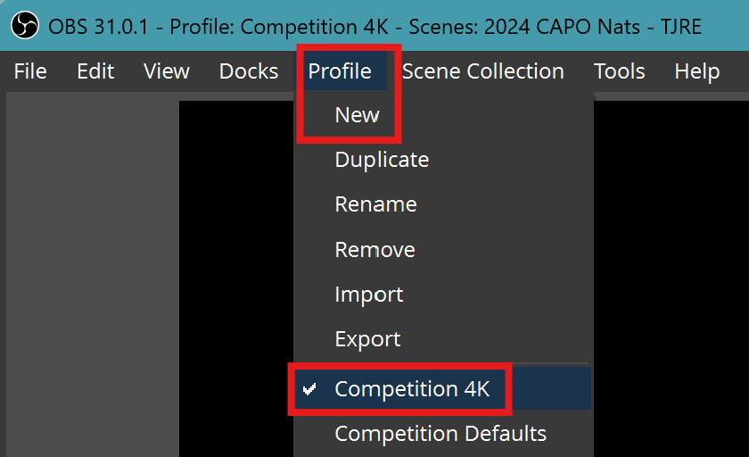
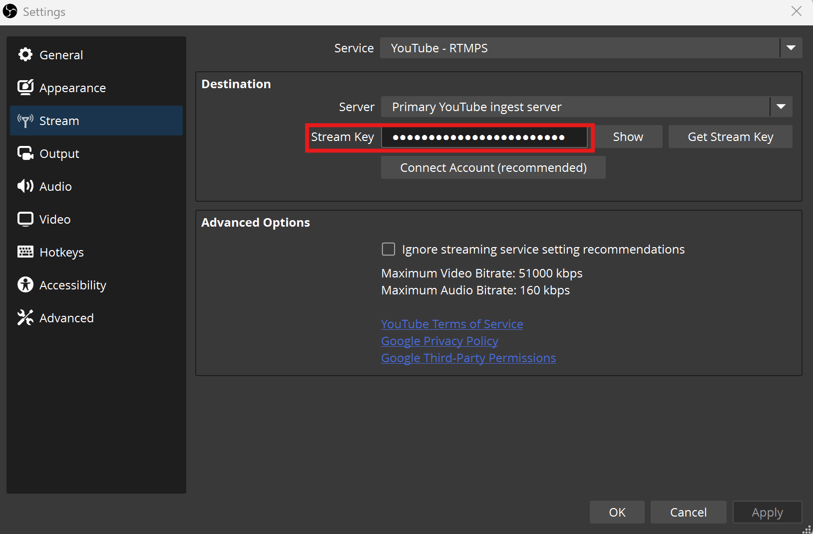
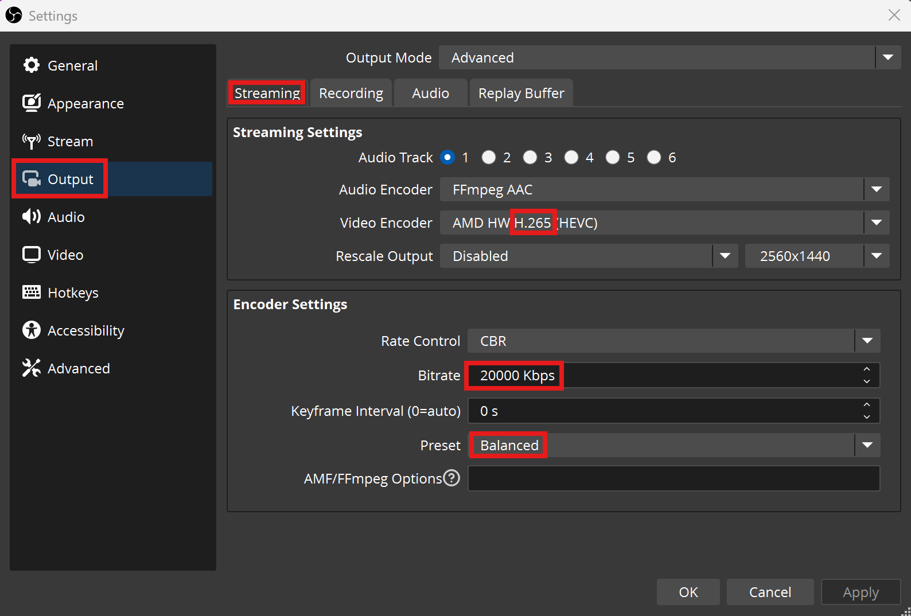
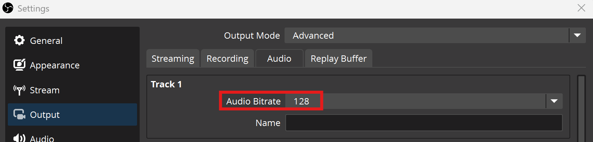
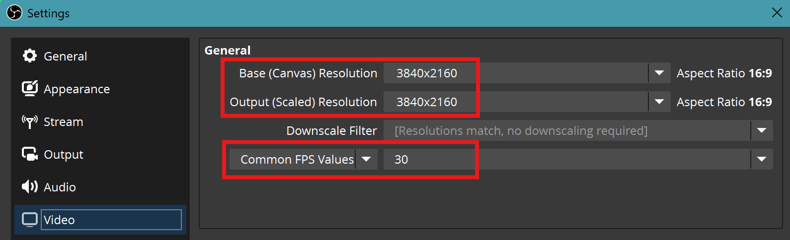
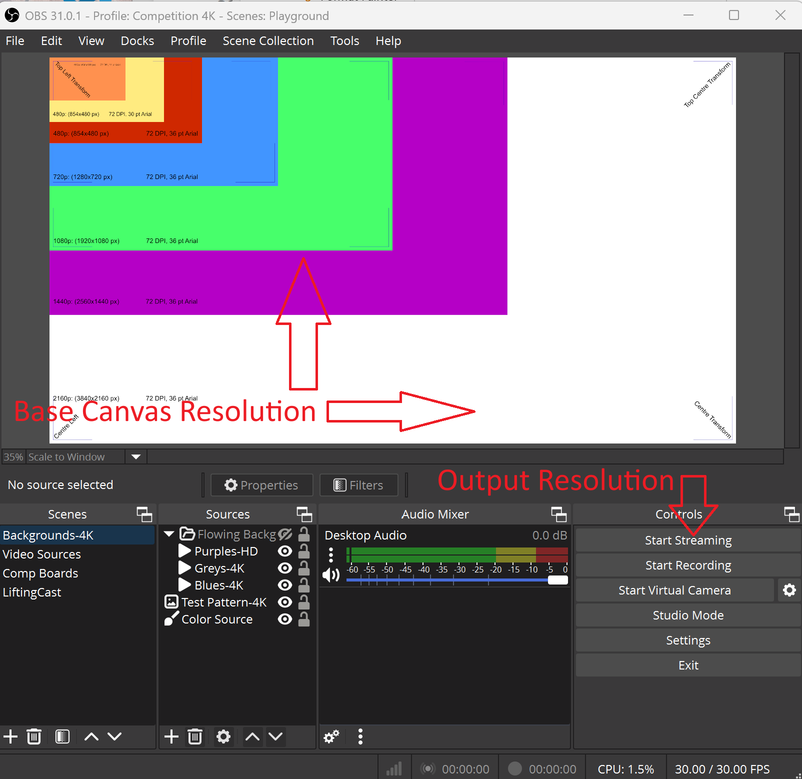

## Configuring OBS for 4K

### Profile Settings
All the settings below will be stored as a ***Profile***.  

- Always create a new profile, so that existing stream profile settings are not lost  

- *Profiles **do not store** the Scenes or Sources*; these are stored under *Scene Collection*  

**OBS Profiles can be Exported and Imported**  

| 
Check List
 | OBS   |
| ------- | :-------------------------: |
| OBS → Profile → New  | |

### Stream Settings
- OBS Settings MUST use a [stream key for 4K](youtube-studio-setup.md#existing-4k-api-key)  
- Connect Account option will NOT use a custom 4K Stream Key  

| 
Check List
 | OBS   |
| ------- | :-------------------------: |
| OBS → File → Settings → Stream |  |

### Output Settings
Output settings will greatly depend on hardware CPU + GPU, these are the *minimum* settings  

- Output Mode **Advanced**  
- Audio Track - **1**  
- **H.264** or **H.265** (**Hardware** Required, maybe AMD or Nvidia, or even Intel)  
- Bitrate -- **20000 Kbps**  
- Preset -- **Balanced**  

4K is not possible on old hardware.  

| 
Check List
 | OBS   |
| ------- | :-------------------------: |
| OBS → File → Settings → Output → Streaming |  |

### Audio Settings
Default must be changed to a *lower* value for **Track 1** to match YouTube recommendations  

- Audio Bitrate - **128**  

| 
Check List
 | OBS   |
| ------- | :-------------------------: |
| OBS → File → Settings → Output → Audio | 

### OBS Canvas
Set both  
- Base Canvas (Preview) and  
- Output (Streaming)  

to **3840x2160** (4K/2160p) resolution.  

It can be **manually typed in** if the dropdown box does not show it (Which will be due to physical monitor resolution limitations)  

**FPS will be determined by Hardware**, 60 is only possible if the hardware is capable  

| 
Check List
 | OBS   |
| ------- | :-------------------------: |
| OBS → File → Settings → Video |  |
| OBS Canvas View               |  |