Purpose:

- Platform camera
- Competitor stats
- Sponsor logos

## Scene

|  
Step
                       |             OBS ScreenShot                |
|:-----------------------------------------------------------|:-----------------------------------------:|
| Scene :material-arrow-right: :heavy_plus_sign: (Add Scene) | 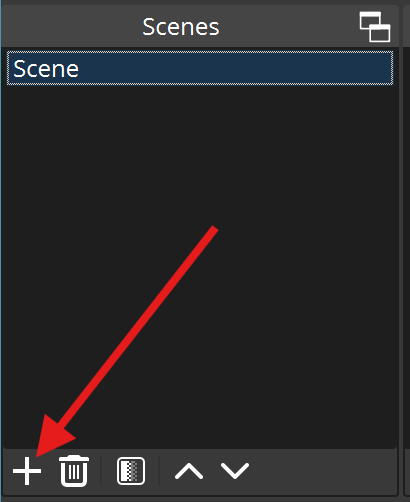       |
| Name the Scene  <b>Alternate - Commentator</b>          |   |

## Groups

- Begin by creating all the groups required
- If you have already created some of these groups in other Scenes, you will just use the existing group, which will have the existing sources applied (although not all transforms or filters)
- `Main Platform Video Alternate` Group is **different** to the `Main Platform Video` Group, as there are border filters applied which we don't want on the main broadcast

| 
Step
                               |        OBS Screenshot                                            |
|:------------------------------------------------------------------|:----------------------------------------------------------------:|
| Sources :material-arrow-right: :heavy_plus_sign:  (Add Source)    | 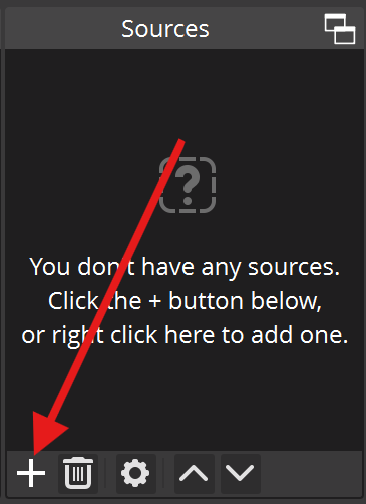                            |
| Create Groups                                                     | 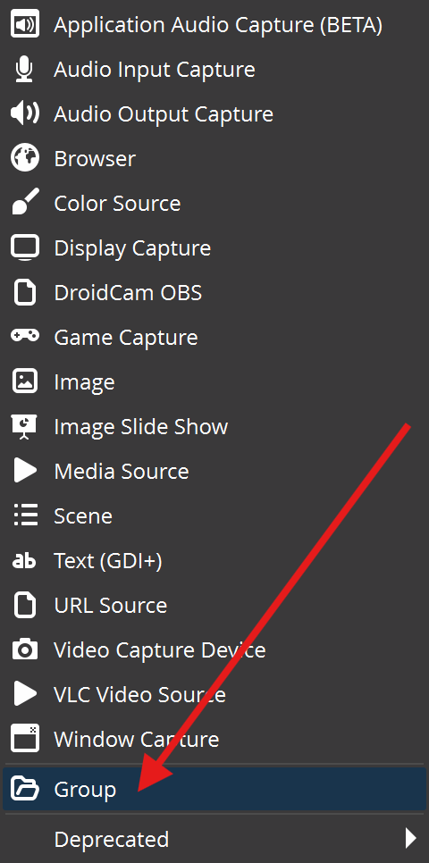                      |
| Add the *existing* Groups in order <b> <ul>  <li>Flows</li><li>SponsorsBottomLeft</li><li>SponsorsTopLeft</li><li>LiftingCast-PlatformR</li><li>LiftingCast-PlatformL</li><li>Main Platform Video Alternative</li><li>Cam1Group</li><li>Logo</li></ul></b> Note: these will appear in *reverse* order | 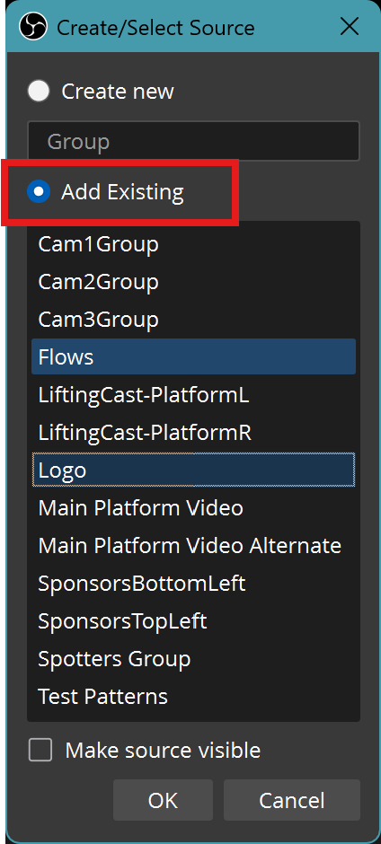 |
| Completed Sources *Group* List and Ordering                       |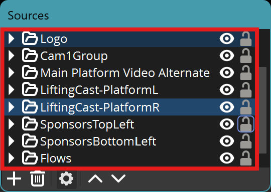 |

## Sources

- If you have already created some of these groups or sources in other Scenes, you will just use the existing source

### LiftingCast-PlatformR

| 
Step
                               |        OBS Screenshot                                            |
|:------------------------------------------------------------------|:----------------------------------------------------------------:|
| `LiftingCast Platform Right`   Contains the following Sources set to the bottom-right of the Scene  **Note:**Before [Transforms](#transforms) and [Filters](#filters) have been applied, the items will be stacked in their default positions |  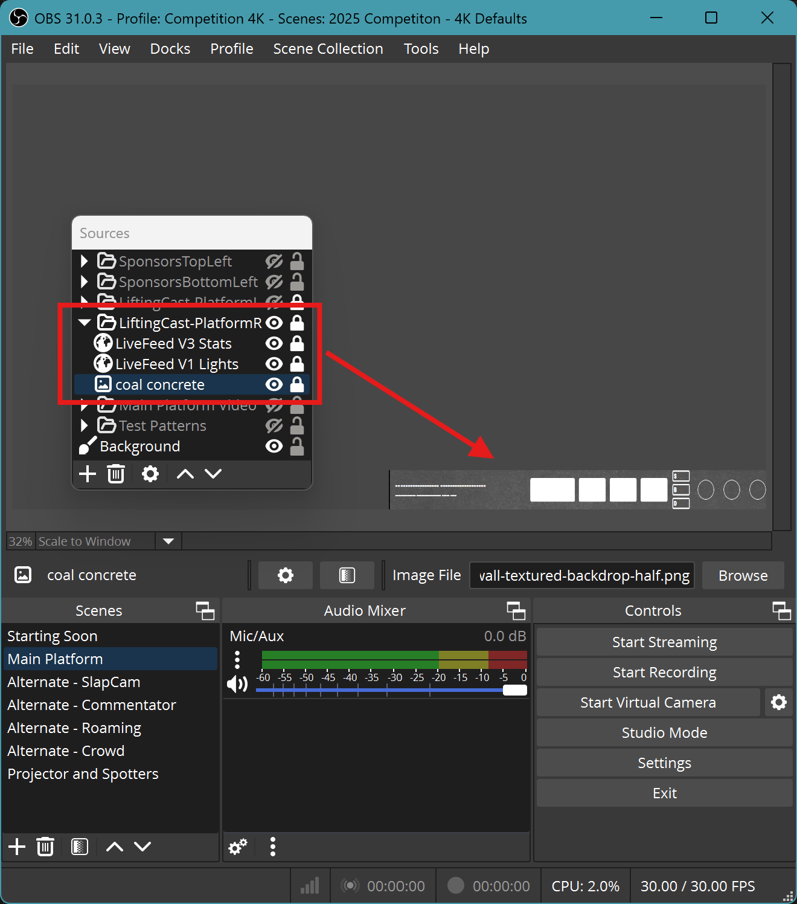 |
| **1920x2160 (Half-Width 4k)** Use the existing source | 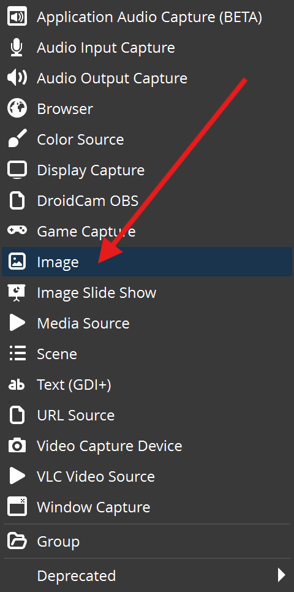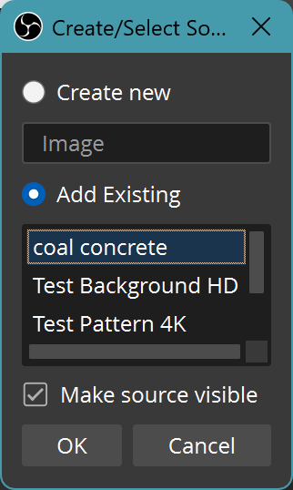  |
| **LiveFeed V3 Stats** Use the existing source  | 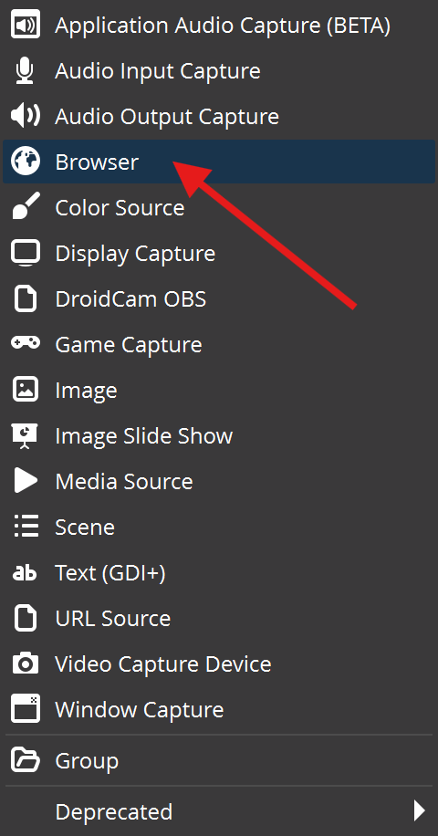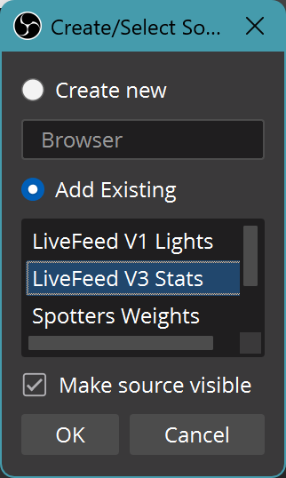  |
| **LiveFeed V1 Lights** Use the existing source | 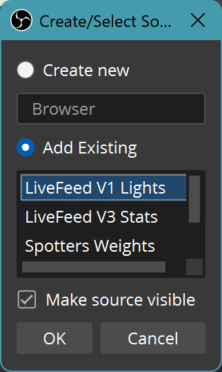  |

### LiftingCast-PlatformL

| 
Step
                               |        OBS Screenshot                                            |
|:------------------------------------------------------------------|:----------------------------------------------------------------:|
| `LiftingCast Platform Left`   Contains the following Sources set to the bottom-left of the Scene  **Note:**Before [Transforms](#transforms) and [Filters](#filters) have been applied, the items will be stacked in their default positions |  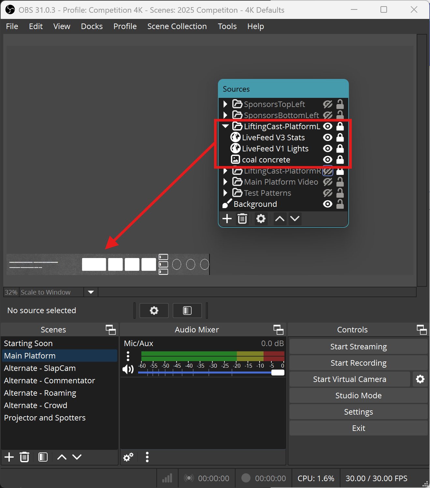 |
| **1920x2160 (Half-Width 4k)** Use the existing source |   |
| **LiveFeed V3 Stats** Use the existing source  |   |
| **LiveFeed V1 Lights** Use the existing source |   |

### Competiton Logo
This Image will generally change every competiton, and may require various versions added to OBS as different image sources:

 - to suit the placement
 - with or without transparent backgrounds 
 - various colour schemes

Use the Affinity products to modify a logo that may not quite suite the broadcast 
As a general guide, for logo design, consider the following
 
- ✅ Square, Oval, Circle, Triangle type logos generally work best where the Height:Width dimensions are **1:1**
- ✅ Logos that look good with Transparency and multiple different background colours also work
- 🚫 a large amount of black background do not work
    - they become washed out against other lighter or moving backgrounds
- 🚫 share a colour with another element of the logo (ie outer black background + inner black background wording)
    - The software can only mask on a colour, not parts of a logo without time consuming edits

- ✅ Parts of thick line-art (ie comic book style) or shadowing etc
    - ✅ Using a slightly different 'black' (ie #010101 vs #000000 ) where it is required

You may require a slightly different logo for the broadcast compared to the physical versions present on t-shits, posters, facebook etc

General steps to add an image in OBS as a Source, you can add as many as required

| 
Step
                               |        OBS Screenshot                                                        |
|:------------------------------------------------------------------|:----------------------------------------------------------------------------:|
|  Sources → Add Source → Image          |                      |
|  Name the Source (CompLogo or similar) | 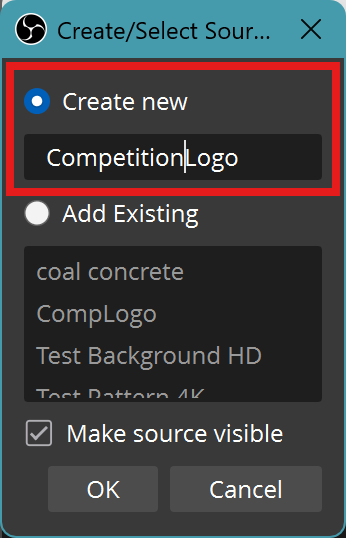                                                   |
|  Choose the relevant Logo              | 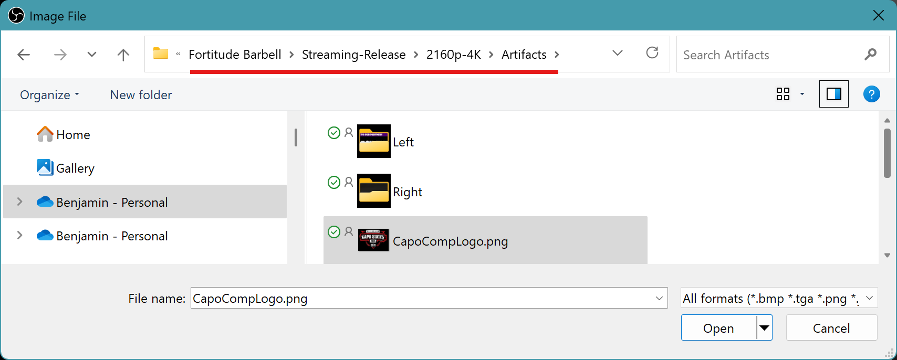                                                             |
|  Move the Source into the Logo Group   | 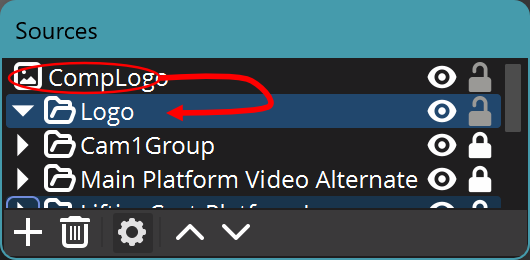 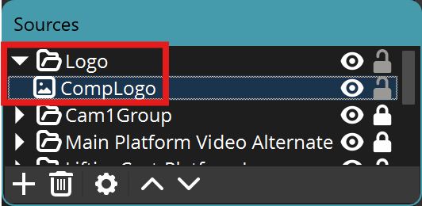 |
|  Hide the Source and Group until it's ready for transforms and filters to be applied | 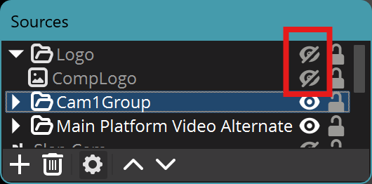                    |

## Transforms

## Filters

## Transitions
