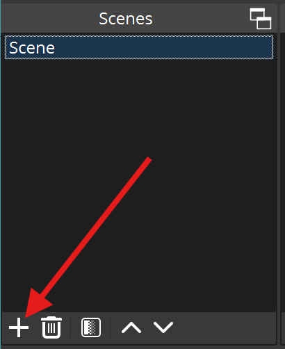
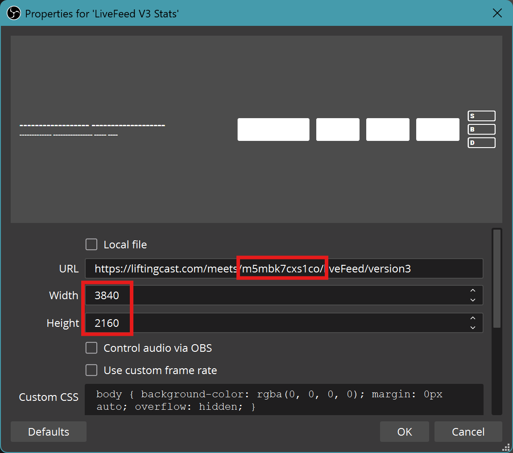
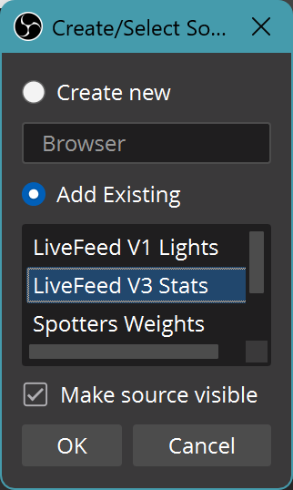

Purpose:

- Platform camera
- Competitor stats
- Sponsor logos

## Scene

|  
Step
                       |             OBS ScreenShot                |
|:-----------------------------------------------------------|:-----------------------------------------:|
| Scene :material-arrow-right: :heavy_plus_sign: (Add Scene) |        |
| Name the Scene  <b>Main Platform</b>                    |   |

## Groups

- Begin by creating all the groups required

| 
Step
                               |        OBS Screenshot                                            |
|:------------------------------------------------------------------|:----------------------------------------------------------------:|
| Sources :material-arrow-right: :heavy_plus_sign:  (Add Source)    |                             |
| Create Groups                                                     |                       |
| Create the following Groups in order <b> <ul>  <li>Test Patterns</li><li>Main Platform Video</li><li>LiftingCast-PlatformR</li><li>LiftingCast-PlatformL</li><li>SponsorsBottomLeft</li><li>SponsorsTopLeft</li></ul></b> Note: these will appear in *reverse* order |  |
| Completed Sources *Group* List and Ordering                       | |

## Sources

### SponsorsTopLeft

| 
Step
                               |        OBS Screenshot                                            |
|:------------------------------------------------------------------|:----------------------------------------------------------------:|
|||

### SponsorsBottomLeft

| 
Step
                               |        OBS Screenshot                                            |
|:------------------------------------------------------------------|:----------------------------------------------------------------:|
|||

### LiftingCast-PlatformR

| 
Step
                               |        OBS Screenshot                                            |
|:------------------------------------------------------------------|:----------------------------------------------------------------:|
| `LiftingCast Platform Right`   Contains the following Sources set to the bottom-right of the Scene  **Note:**Before [Transforms](#transforms) and [Filters](#filters) have been applied, the items will be stacked in their default positions |   |
| **1920x2160 (Half-Width 4k)** `Fortitude Barbell\Streaming-Release\2160p-4K\Artifacts\` `solid-painted-concrete-wall-textured-backdrop-half.png`  Background image. Resolution set for positioning and sizing            |   |
| **LiveFeed V3 Stats** [https://liftingcast.com/meets/**YOUR MEET ID**/liveFeed/version3](https://liftingcast.com/) Set to the Current **Meet ID** showing Competitor and Lifts Set the Web resolution to 4K **(3840x2160)** |   |
| **LiveFeed V1 Lights** [https://liftingcast.com/meets/**YOUR MEET ID**/liveFeed/](https://liftingcast.com/) Set to the Current **Meet ID** showing the Competitor Lights Set the Web resolution to 4K **(3840x2160)**       |   |

### LiftingCast-PlatformL

| 
Step
                               |        OBS Screenshot                                            |
|:------------------------------------------------------------------|:----------------------------------------------------------------:|
| `LiftingCast Platform Left`   Contains the following Sources set to the bottom-left of the Scene  **Note:**Before [Transforms](#transforms) and [Filters](#filters) have been applied, the items will be stacked in their default positions |   |
| **1920x2160 (Half-Width 4k)** Use the existing source |   |
| **LiveFeed V3 Stats** Use the existing source  |   |
| **LiveFeed V1 Lights** Use the existing source |   |

### Main Platform Video

| 
Step
                               |        OBS Screenshot                                            |
|:------------------------------------------------------------------|:----------------------------------------------------------------:|
|||

### Test Patterns

| 
Step
                               |        OBS Screenshot                                            |
|:------------------------------------------------------------------|:----------------------------------------------------------------:|
|||

### Background

| 
Step
                               |        OBS Screenshot                                            |
|:------------------------------------------------------------------|:----------------------------------------------------------------:|
|||

## Transforms

## Filters

## Transitions
