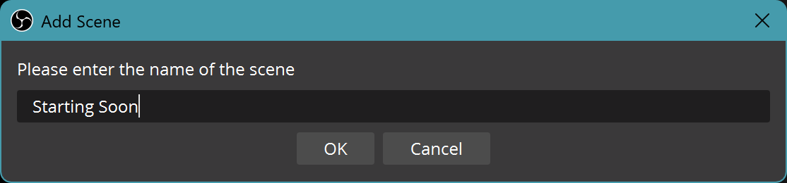
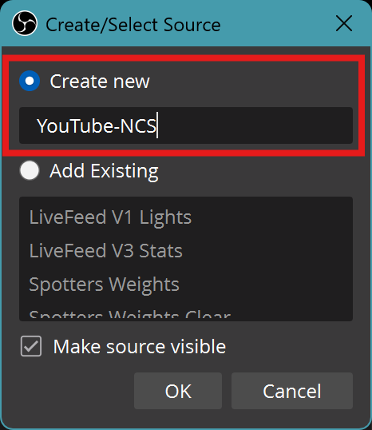
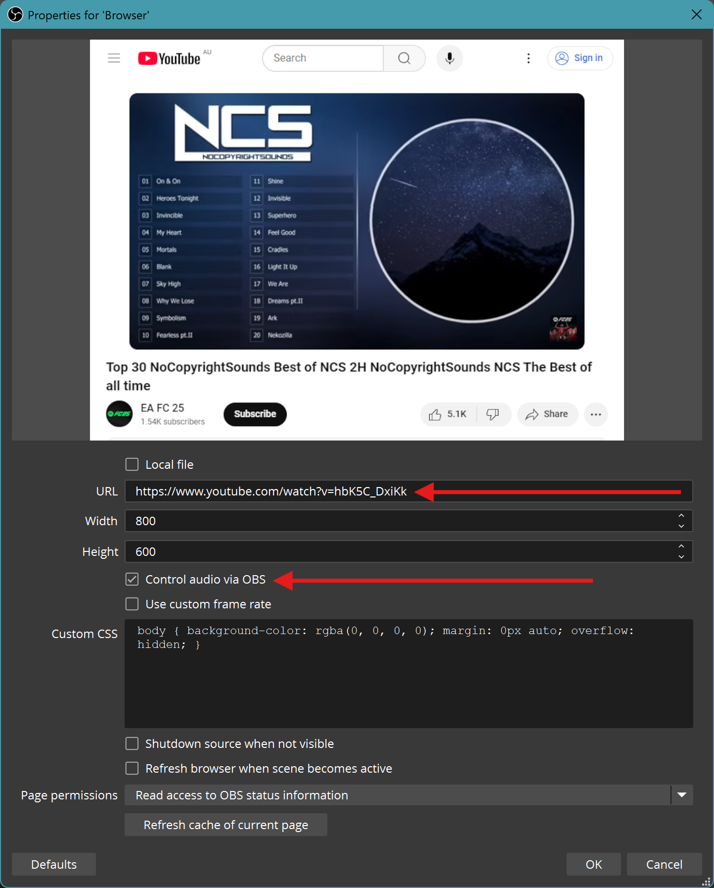
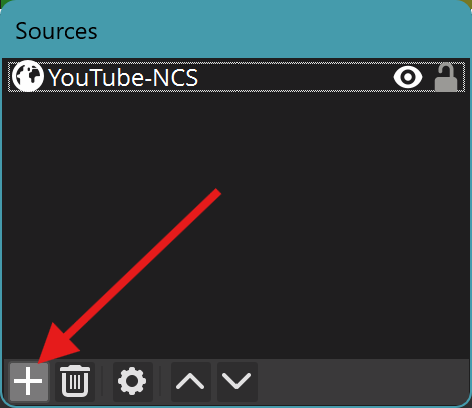
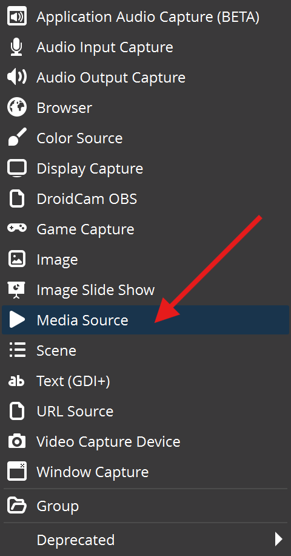
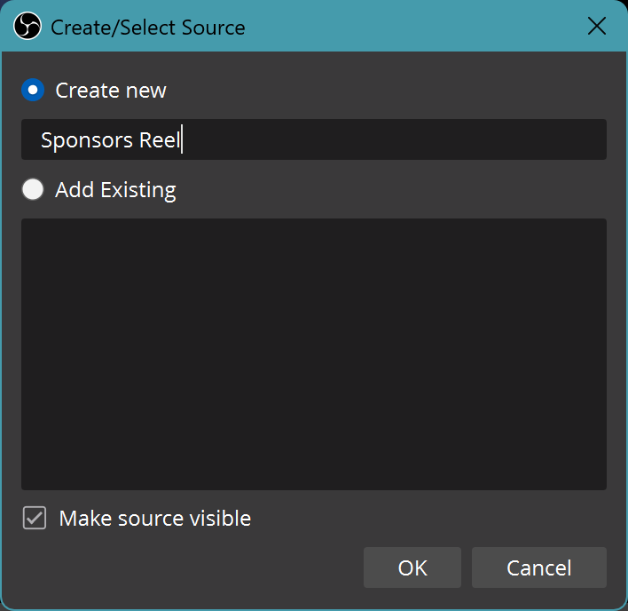
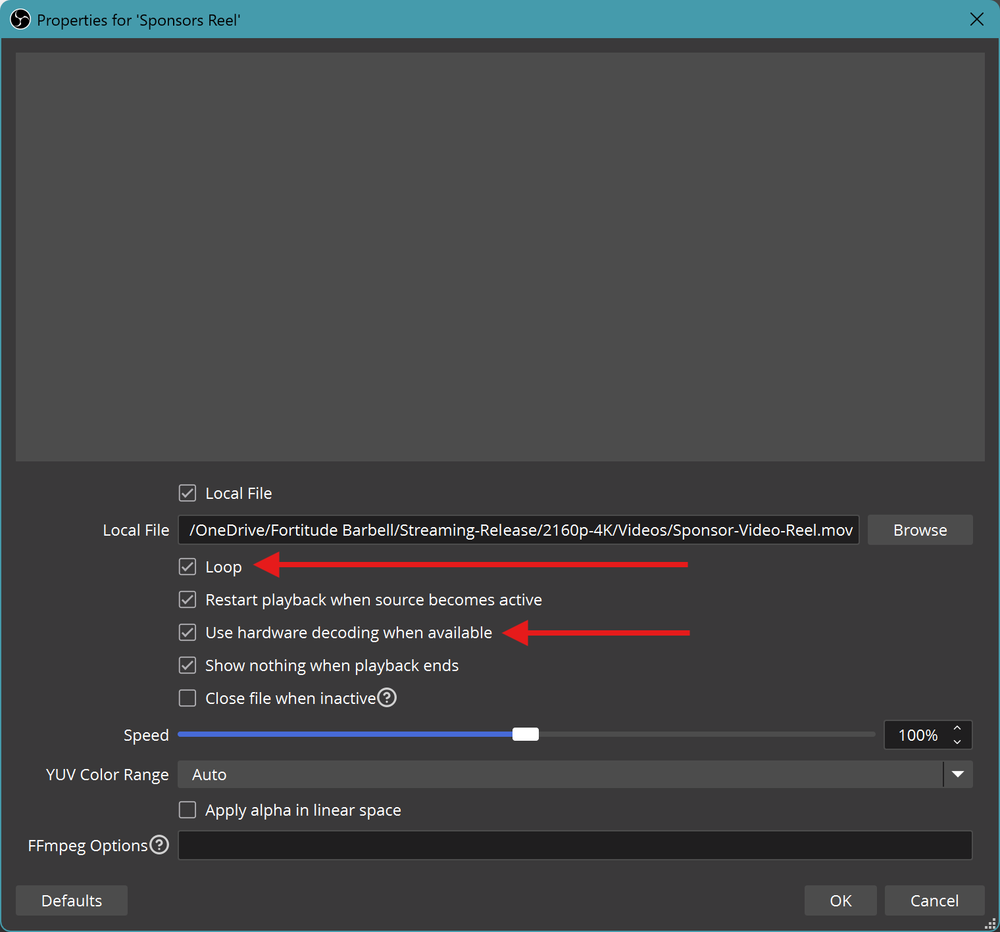
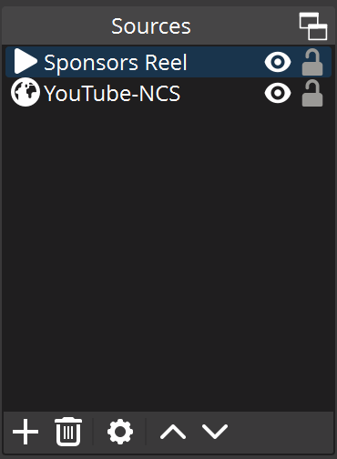
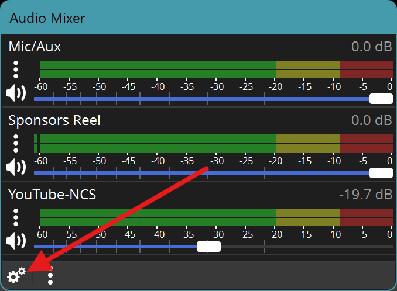
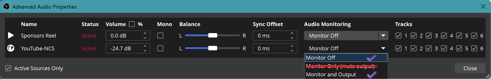

Purpose:

- Pre-competition video reel showing sponsors
- Copyright-free background music

## Scene

|  
Step
                       |             OBS ScreenShot                |
|:-----------------------------------------------------------|:-----------------------------------------:|
| Scene :material-arrow-right: :heavy_plus_sign: (Add Scene) |        |
| Name the Scene  <b>Starting Soon</b>                    |   |

## Sources

| 
Step
                               |        OBS Screenshot                                            |
|:------------------------------------------------------------------|:----------------------------------------------------------------:|
| Sources :material-arrow-right: :heavy_plus_sign:  (Add Source)    |                             |
| Browser Source                                                    |                     |
| Name the Source  <b>Youtube-NCS  </b>                          |                         |
| Browser Properties  URL: [https://www.youtube.com/watch?v=hbK5C_DxiKk](https://www.youtube.com/watch?v=hbK5C_DxiKk)  :heavy_check_mark: Control audio via OBS    |  |
| Sources :material-arrow-right: :heavy_plus_sign:  (Add Source)    |                          |
| Media Source                                                      |                |
| Name the Source  <b>Sponsors Reel</b>                          |                         |
| Path: OneDrive/FortitudeBarbell/Streaming-Release/2160p-4K/Videos/Sponsor-Video-Reel.mov|    |
| Media Properties  :heavy_check_mark: Enable loop option :heavy_check_mark: Use hardware decoding when available |  |
| Completed Sources List and Ordering                               | |

## Audio Mixer
| 
Step
        |                OBS Screenshot                   |
|:-------------------------------------------|:-----------------------------------------------:|
| Audio Mixer Config Option                  |       |
| Configure to desired settings              |  |

