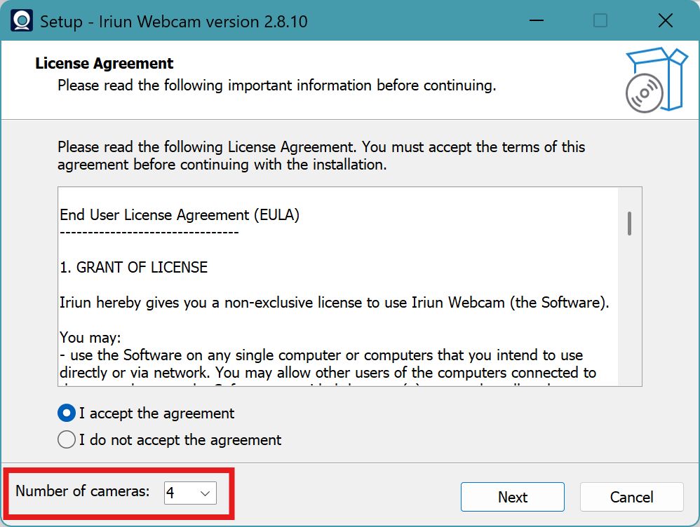

## Software

Software requirement links

These is the recommended software to have in place for a successful broadcast in 4K

### Software Required

These are all free, and are available either on the links, 
or in the shared OneDrive folder `Fortitude Barbell\Streaming-Release\Software`

- [OBS](https://obsproject.com/){ target="_blank" } – Open Broadcaster Software for live streaming and recording
    - [OBS Filter - obs-shaderfilter](https://github.com/exeldro/obs-shaderfilter/releases){ target="_blank" } - Open Broadcaster Software Plugin for filter borders
- [Davinci Resolve](https://www.blackmagicdesign.com/products/davinciresolve/){ target="_blank" } – Professional video editing
- [Iriun WebCam](https://iriun.com/){ target="_blank" } – Use upto 4 Android/iPhones as separate distinct WiFi webcam devices for your computer
    - When Installing, ensure 'Number of Cameras - 4' is selected 

These are the mobile apps for Iriun for iPhone or Android

- [Iriun Webcam for Android (Google Play)](https://play.google.com/store/apps/details?id=com.jacksoftw.webcam){ target="_blank" } – Android app for Iriun Webcam
- [Iriun Webcam for iOS (App Store)](https://apps.apple.com/app/iriun-webcam-for-pc-and-mac/id1505937006){ target="_blank" } – iOS app for Iriun Webcam

### Software Recommendation

These are recommended, but have a one time cost, albiet not too expensive, it's frequently on sale every 6 months or so, and doesnt require an ongoing subscription

- [Affinity V2 Universal License](https://affinity.serif.com/en-us/universal-licence/){ target="_blank" } – Professional photo, design, and publishing software

