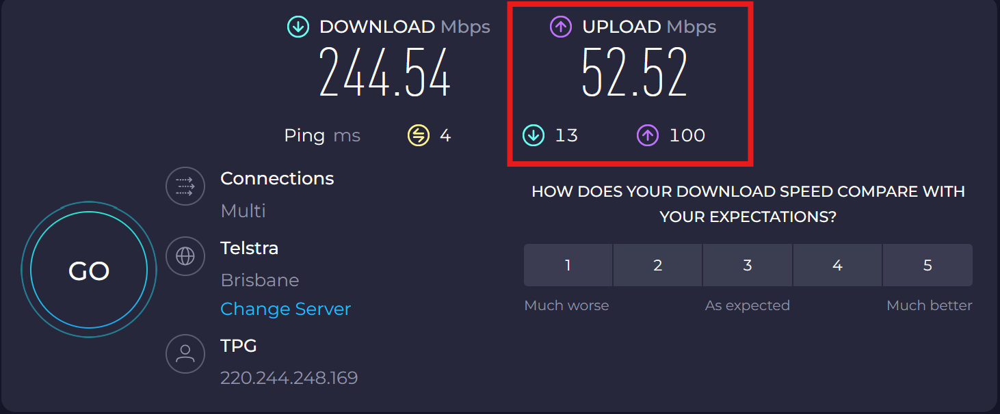

## What is 4K?

4K (2160p) refers to an ultra-high-definition video resolution of **3840×2160 pixels**, delivering:

- 4× the detail of 1080p HD  
- Sharper image quality  
- More immersive viewing experience (especially on large screens)  

## Requirements for 4K Streaming

### YouTube Requirements
- ✅ Special 4K-enabled streaming key  
- ✅ Support for high frame rates (up to 60fps)  
- 🚫 Standard keys limit streams to lower resolutions (1080p or lower)

### Hardware Considerations
- High upload bandwidth (≥30 Mbps recommended)  
- Powerful CPU/GPU for encoding (Typically NVidia or AMD)
- 4K-capable Video Sources (ie Platform Camera, HDMI TX/RX devices) 
- 4K-capable capture devices (The HDMI **input** device attached via USB-C)

## Internet Speed

Ensure there is enough upload bandwidth to use 4K streaming. 
 Minimum Upload Speed for 4K Streaming is >=30 Mbps 

| 
Check List
 | Speedtest   |
| ------- | :-------------------------: |
| [https://www.speedtest.net](https://www.speedtest.net){ target="_blank" } |  |

---

## Youtube Studio
### Permissions

- Logged in as Fortitude Barbell  
- **Preferred: A channel manager with your own Gmail account**  
- YouTube Channel Settings to add a Manager Role  

| 
Check List
                       |       Youtube Studio      |
| --------------------------------------------------------------- |:-------------------------:|
| [Youtube Studio](https://studio.youtube.com){ target="_blank" } |   |
| Check Youtube Role                                              |   |

---

### Existing 4K API Key
YouTube requires a 4K enabled Streaming Key
There should be a key already available that allows 4K (2160p) resolution and up to 60 Frames per second  

| 
Check List
 |       Youtube Studio      |
| ------------------------------------------|:-------------------------:|
| Click *Create → Go Live*                  |                  |
| Copy the **4K** Stream Key for OBS        |  |

---

### New 4K API Key
YouTube requires a 4K enabled Streaming Key  
***ONLY* If the key is *NOT* available perform this step**

| 
Check List
 |       Youtube Studio      |
| ------------------------------------------|:-------------------------:|
| Click *Create → Go Live*                  |         |
| Create a new key with                     |         |
| Use manual settings and enable 2160p      |  |
| Copy the **4K** Stream Key for OBS        |         |

---
